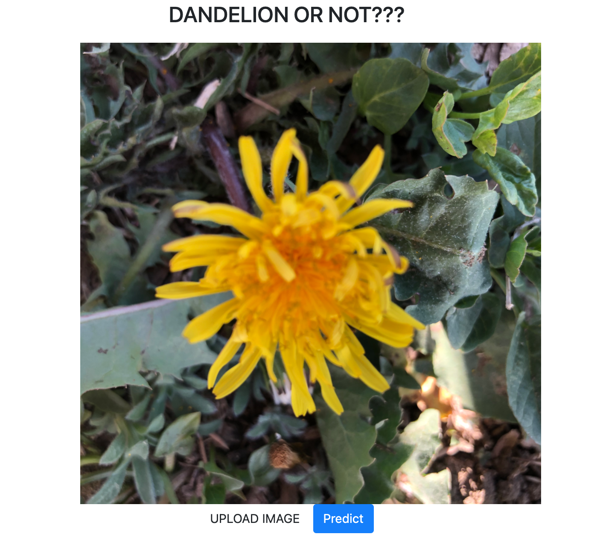

# Dandelion or Not?
__Deep Learning Model__ 
In this project, a deep learning model was developed to predict if an image contains dandelion (including leaves) or not. The purpose of detecting leaves is to identify dandelions even before the flower blooms. 
The dataset to train the model was obtained from Kaggle. It contained over 1200 images which were loaded to Amazon S3 bucket to facilitate acces for model training.

A sequential classification model based on neural network was built to predict the presence of dandelion.  

The model summary is shown below: 
 
The images were scaled to different sizes (180x180, 540x540 & 720x720) to improve model accuracy. In addition, number of epochs, activation methods (reLu, sigmoid) were varied to address overfitting and over training.  Below you can see the training and validation accuracy and loss for three image sizes.  
 
 
__180x180__

 
 
__720x720__  

 
 
__540x540__  

The 540x540 image size and 7 epochs were chosen for the final model (static/models/DandelionModel2.h5). We chose this model to keep the model size manageable and to minimize training loss.
The flask application can be launched to upload an image for prediction. Below is a snapshot of the homepage

